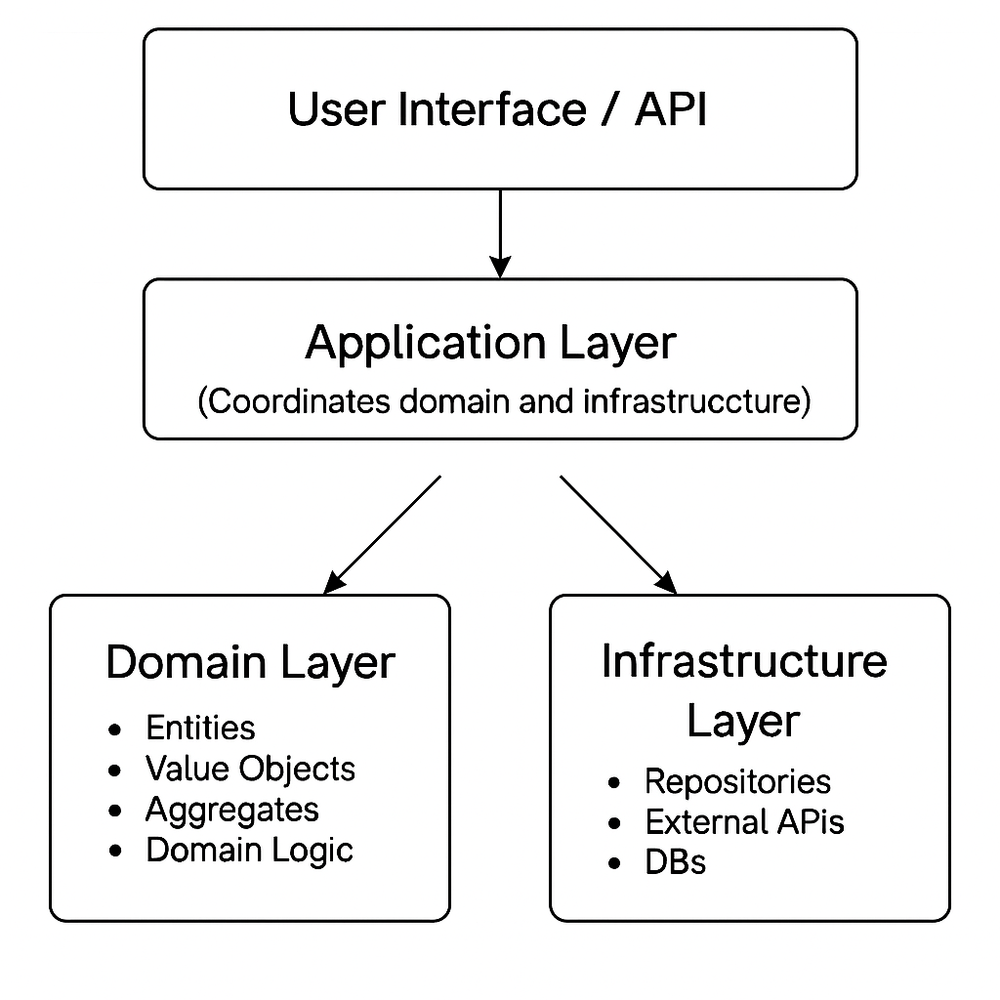

# 🚀 Building Better Software with Domain-Driven Design: A Step-by-Step Example


Domain-Driven Design (DDD) is a powerful way to design software by putting the business domain at the center. If you're a beginner wondering where to start, this guide will walk you through DDD step-by-step using a real-world example: a simple online bookstore.

---

## 🔍 Step 1: Understand Your Domain

Imagine you’re tasked with building an online bookstore from scratch. Orders are flying in, inventory’s a mess, and the boss wants it live yesterday. Where do you start? Step one: know your domain. For us, that’s an online bookstore with these core concepts:

- Books are sold online.
- Customers place orders for books.
- We track inventory.
- Orders are confirmed, paid for, and shipped.

> ✨ **Design Insight**: Start by chatting with domain experts or stakeholders—like the bookstore owner or shipping team. DDD’s ubiquitous language is your team’s secret handshake: a shared vocabulary that keeps everyone on the same page.

---

## 🔑 Step 2: Define Entities and Value Objects

### ✅ Entities

Entities have a unique identity that sticks with them through their lifecycle.

```kotlin
data class Customer(
    val customerId: UUID,    // Unique ID ties this customer to their journey
    val name: String,
    val email: String,
    val shippingAddress: Address
)
```

### ✅ Value Objects

Value Objects don’t care about identity—they’re defined by their values and stay immutable.

```kotlin
data class Address(
    val street: String,
    val city: String,
    val zipCode: String,
    val country: String
)
```

> ✨ **Design Insight**: Use **Value Objects** for simplicity, immutability, and clarity.  
> Value Objects can be stored either:
>
> - As embedded fields (e.g., `Address` as part of `Customer` table).
> - Or in separate tables (e.g., `OrderItem` as a list under `Order`).

> ⚠️ **Important**: If a Value Object is stored in its own table and you assign it a primary key (e.g., `order_item_id`), it's only for technical database reasons.  
> It does **not** change its role in the domain model.

```sql
-- Embedded Value Object (Address inside Customer)
CREATE TABLE customer (
                          customer_id UUID PRIMARY KEY,
                          name VARCHAR(100),
                          email VARCHAR(100),
                          address_street VARCHAR(100),
                          address_city VARCHAR(100),
                          address_zip_code VARCHAR(10),
                          address_country VARCHAR(50)
);

-- Value Object stored in its own table (OrderItem)
CREATE TABLE order_items (
                             order_item_id UUID PRIMARY KEY, -- technical ID for indexing only
                             order_id UUID,
                             book_id UUID,
                             quantity INT,
                             price DECIMAL(10,2)
);
```

---

## 🛒 Step 3: Define Aggregates

An Aggregate is a crew of related domain objects with one boss—the Aggregate Root—keeping everything consistent.

**Example: Order as an Aggregate Root**

```kotlin
class Order(
    val orderId: UUID,          
    val customer: Customer,     
    val orderItems: List<OrderItem>  
) {
    var orderStatus: OrderStatus = OrderStatus.NEW
        private set  
    
    fun confirmOrder(paymentConfirmed: Boolean) {
        require(paymentConfirmed) { "Payment not confirmed" }
        orderStatus = OrderStatus.CONFIRMED
    }

    fun shipOrder() {
        require(orderStatus == OrderStatus.CONFIRMED) { "Order must be confirmed before shipping" }
        orderStatus = OrderStatus.SHIPPED
    }
}
```

> ✨ **Design Insight**:
>
> - Aggregates ensure consistency and encapsulate business rules.
> - Aggregates are responsible for transactions. A transaction boundary should **never** span multiple aggregates.

---

## 📦 Step 4: Repositories - Saving and Loading Aggregates

Repositories are your Aggregate’s personal assistants, fetching and storing them.

```kotlin
interface OrderRepository {
    fun findById(orderId: UUID): Order?
    fun save(order: Order)
}
```

> ✨ **Design Insight**:  
> Keep repository interfaces in the **domain layer**, but put their implementations in the **infrastructure layer**.  
> For example: `InMemoryOrderRepository` or `JdbcOrderRepository`.

---

## ⚙️ Step 5: Application Layer - Orchestration

The Application Layer is the conductor, waving the baton but not playing the instruments.

```kotlin
class OrderService(
    private val orderRepository: OrderRepository,
    private val paymentService: PaymentService,
    private val inventoryService: InventoryService
) {
    fun confirmOrder(orderId: UUID, paymentId: UUID) {
        val order = orderRepository.findById(orderId)
            ?: throw IllegalArgumentException("Order not found")

        val paymentConfirmed = paymentService.verifyPayment(paymentId, order.totalAmount)
        order.confirmOrder(paymentConfirmed)

        orderRepository.save(order)
    }
}
```

> ✨ **Design Insight**: This layer’s a traffic cop—directing domain objects but never writing the rules. Business logic stays in the domain, not here.

---

## 🕵️‍♂️ Step 6: Domain Services

Some logic doesn’t fit neatly in an Entity. Enter Domain Services.

**Example: ShippingCostCalculator**

```kotlin
class ShippingCostCalculator {
    fun calculateShippingCost(order: Order): BigDecimal {
        return if (order.customer.shippingAddress.country == "USA") BigDecimal(5) else BigDecimal(15)
    }
}
```

> ✨ **Design Insight**: Domain Services live in the domain layer and contain pure business logic that spans multiple aggregates.

---

## 🛠️ Step 7: Infrastructure Layer

This layer’s the toolbox—databases, APIs, and techy bits.

```kotlin
class InMemoryOrderRepository : OrderRepository {
    private val orders = mutableMapOf<UUID, Order>()
    override fun findById(orderId: UUID) = orders[orderId]
    override fun save(order: Order) { orders[order.orderId] = order }
}
```

> ✨ **Design Insight**: Infrastructure implements the domain’s interfaces, keeping the core logic clean and free of framework baggage.

---

## 📊 Where to Put Behavior?

| Type              | Owns Behavior? | Examples                          |
|-------------------|----------------|-----------------------------------|
| Entity            | ✅ Yes         | `Order.confirmOrder()`            |
| Value Object      | ✅ Maybe       | `Money.add()`, `Address.format()` |
| Domain Service    | ✅ Yes         | `ShippingCostCalculator`          |
| Application Service | ❌ No        | Coordinates behavior              |

> ✨ **Design Insight**: Behavior’s like furniture—put it where it fits best. Start with the Entity; if it’s awkward, call in a Domain Service.

---

## 📂 Suggested Directory Structure

```plaintext
src/main/kotlin/com/marketplace/
├── domain
│   ├── entities
│   ├── valueobjects
│   ├── repositories
│   └── services               <-- Domain Services go here
├── application
│   └── services               <-- Application Services go here
├── infrastructure
│   └── repositories           <-- In-memory or DB-backed implementations
└── Main.kt
```

> ✨ **Design Insight**:  
> This structure keeps your domain model clean and separate from orchestration and infrastructure logic.


---

## Layered Architecture in Domain-Driven Design



## 🧵 Conclusion: Putting It All Together

DDD isn’t about flashy tools—it’s about making your code work for the business, not the other way around. This little bookstore experiment shows how to split domain logic from tech noise, bundle behavior where it belongs, and let services and infrastructure play nice. Try it on your next project—your future self will thank you.